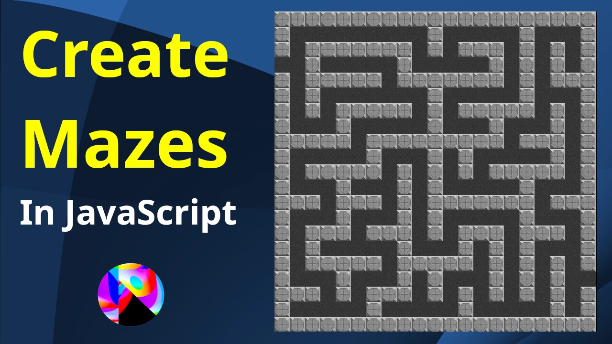
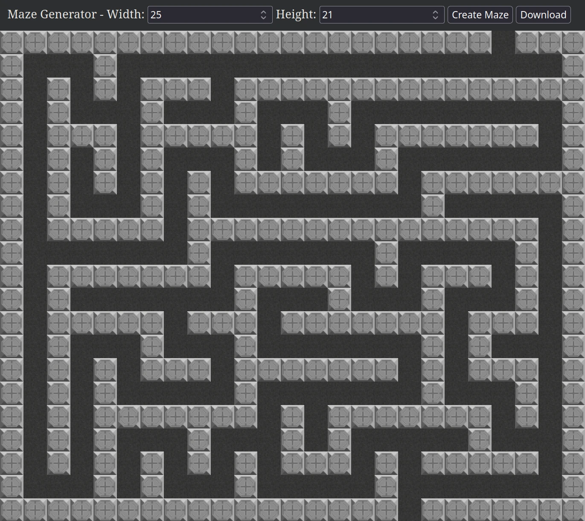

# Maze Generator JavaScript

This project is a mini-maze generator using HTML, CSS and JavaScript. We use the depth-first search algorithm to dig through a 2D array of solid tiles, continuing to dig in random directions until every possible tile is dug!

[There is a video on YouTube](https://www.youtube.com/watch?v=Qfajj84oGUo) describing each part of this code step by step, and with various concepts drawn out!

Wikipedia has an incredible article with really helpful animations for understanding several methods of creating mazes. [Have a look at the article](https://en.wikipedia.org/wiki/Maze_generation_algorithm)!

## Navigation

|                Item                |                       Description                        |
|------------------------------------|----------------------------------------------------------|
| [media](./media)                   | Screenshots and the main thumbnail                       |
| [closed.png](./closed.png)         | An image of a closed tile                                |
| [index.html](./index.html)         | Describes our webpage                                    |
| [maze.js](./maze.js)               | **The main code**                                        |
| [open.png](./open.png)             | An image of an open tile.                                |
| [style.css](./style.css)           | Adds colors, formatting, and other styles to the webpage |

# Screenshot

